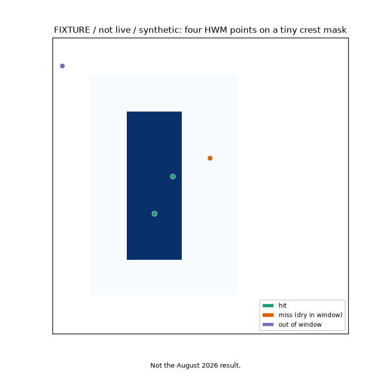
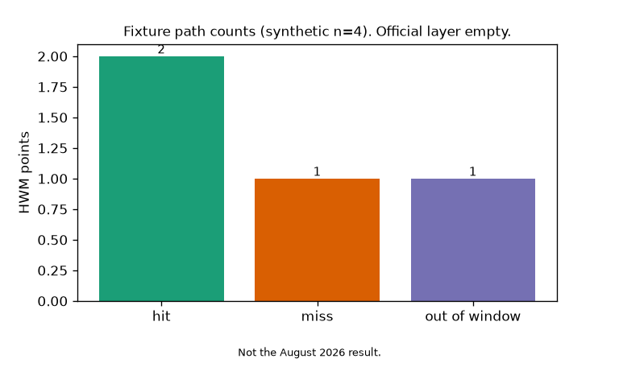

# White River HWM vs Nora crest

Do August 2026 high-water marks land on the Nora HAND wet mask at 21.18 ft?

This tree scores official IDNR / USGS / city high-water marks (points with locations) on the frozen Nora crest wet mask from https://github.com/martialsystems/white_river_stage_inundation (`wet_crest_2026-08-15.tif`, 1876 wet cells, Δ = 4.19 m). A point is a hit if it falls on a wet cell, a miss if it falls on a dry cell in the drain-to-reach window, and out if it is outside that window. The test is water at 21.18 ft, not FEMA and not SIR 2011.

Live fetch of the official layer is a stop: USGS STN FilteredHWMs for Indiana and Marion County return `[]`; ScienceBase has zero 2026 Indiana HWM items. Stage 0 fixture stays green. Live paint does not invent marks.

Sibling Nora v1 `three_wet.png` stays frozen. Two figures max, then this tree stops.

| Official probe (2026-08-28) | Result |
|---|---|
| USGS STN `States=IN` | HTTP 200, empty list |
| USGS STN `States=IN&Counties=Marion` | HTTP 200, empty list |
| ScienceBase "high-water mark Indiana 2026" | total 0 |



Figure 1. Fixture only (four points: two hit, one miss, one out). Live official points are not published yet.



Figure 2. Fixture hit / miss / out. Second and last figure for this tree until an official layer exists.

## Stage 0

```bash
python3.12 -m venv .venv
source .venv/bin/activate
pip install -r requirements.txt
PYTHONPATH=src:. python3 scripts/run_fixture.py logs/stage0_fixture
.venv/bin/python -m pytest tests -q
PYTHONPATH=src:. python3 scripts/run_live.py logs/nora_live
```

Live `run_live.py` exits 2 when the official layer is empty or 404. That is the gate, not a crash.

Related: https://github.com/martialsystems/white_river_stage_inundation

Lanes (maps / White River Q / precip): https://github.com/martialsystems
